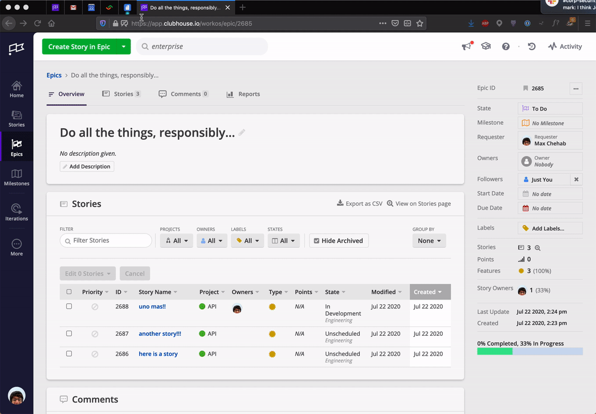

# Clubhouse Quip Integration

Fancy lil' component to show Clubhouse epics in your Quip documents

</img>

## Installation

1. Clone repo
2. Open `src/App.jsx`
3. Set your `CLUBHOUSE_SECRET` with a Clubhouse API Token.
4. Build the app `yarn build`
5. Upload `dist/app.ele` to Quip as a Live App.
